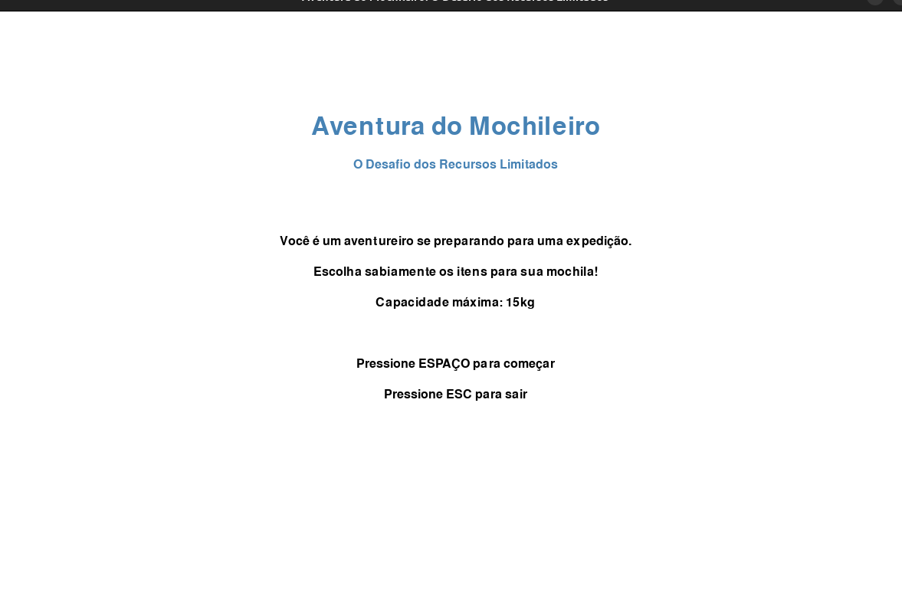
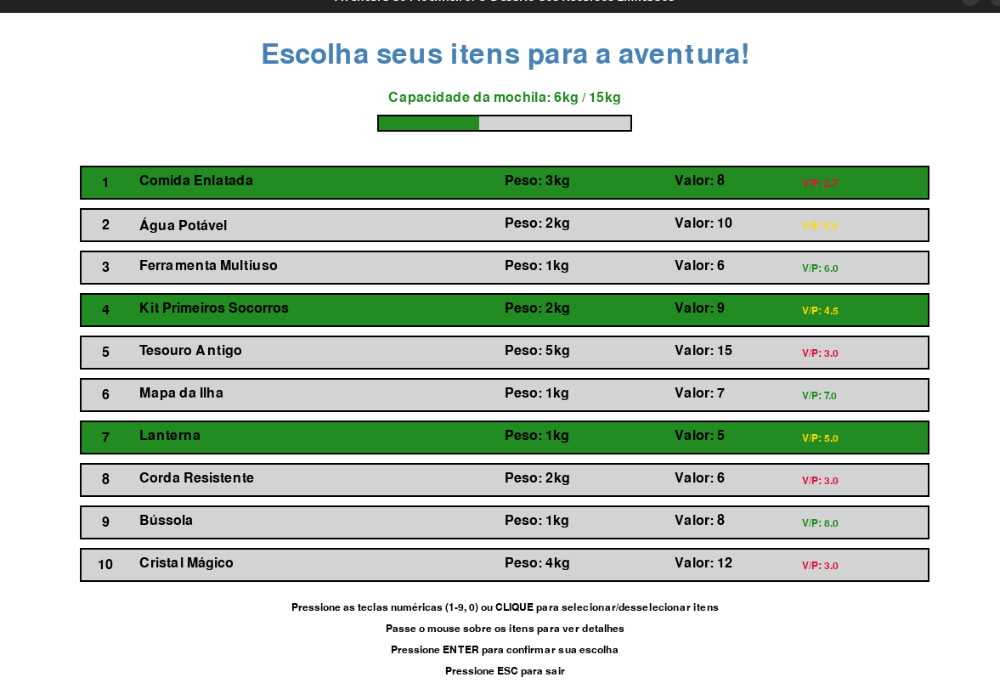
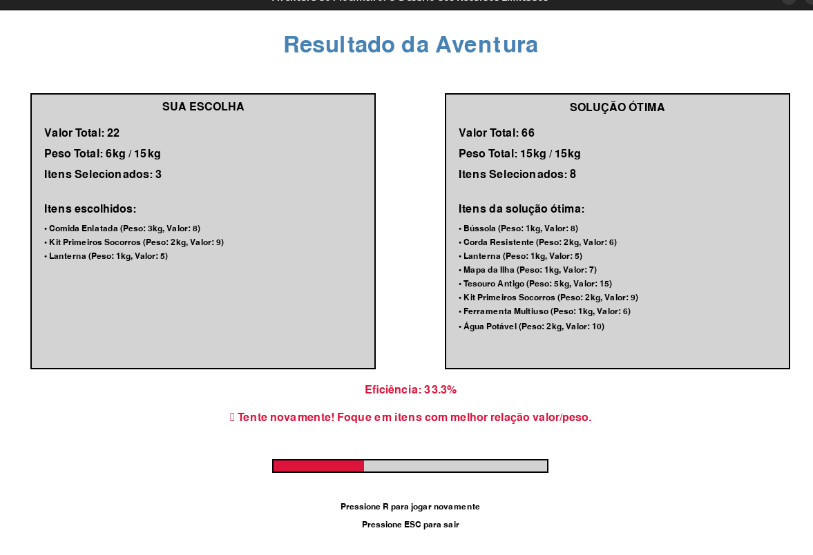

# Aventura do Mochileiro: O Desafio dos Recursos Limitados

Este programa é uma ferramenta educacional interativa que demonstra o funcionamento do algoritmo de programação dinâmica para o problema da mochila 0/1 (0-1 Knapsack Problem), apresentado como um jogo divertido onde o jogador deve escolher itens para uma expedição.

## Alunos
|Matrícula | Aluno |
| -- | -- |
| 22/2021933  |  William Bernardo da Silva |
| 22/2015195  |  Mateus de Castro Santos |

## Requisitos

- Python 3.8 ou superior
- Bibliotecas necessárias (instale-as usando o arquivo requirements.txt)

## Instalação

1. Certifique-se de ter o Python instalado em seu sistema
2. Instale as dependências necessárias:

```bash
pip install -r requirements.txt
```

## Como Executar

Execute o programa com o seguinte comando:

```bash
python jogo_mochila.py
```

## Como Usar

1. Na **tela do menu**, pressione ESPAÇO para começar o jogo
2. Na **tela do jogo**:
   - Use as teclas numéricas (1-9, 0) ou clique do mouse para selecionar/desselecionar itens
   - Passe o mouse sobre os itens para ver descrições detalhadas nos tooltips
   - Observe a barra de capacidade da mochila para não exceder 15kg
   - Pressione ENTER para confirmar sua seleção
3. Na **tela de resultado**:
   - Compare sua escolha com a solução ótima calculada pelo algoritmo
   - Veja sua eficiência e receba feedback sobre sua performance
   - Pressione R para jogar novamente

## Funcionalidades

- Interface gráfica intuitiva com pygame
- Seleção interativa de itens por teclado ou mouse
- Tooltips informativos com descrições detalhadas dos itens
- Indicadores visuais coloridos para relação valor/peso
- Efeitos de hover e animações para melhor experiência
- Validação em tempo real da capacidade da mochila
- Algoritmo de programação dinâmica para cálculo da solução ótima
- Sistema de pontuação com feedback educativo baseado na eficiência

## Sobre o Algoritmo da Mochila 0/1

O problema da mochila 0/1 é um problema clássico de otimização combinatória. Dado um conjunto de itens, cada um com um peso e valor, o objetivo é selecionar itens para colocar na mochila de forma a maximizar o valor total sem exceder a capacidade de peso. O algoritmo de programação dinâmica resolve este problema de forma eficiente, construindo uma tabela que considera todas as possíveis combinações de itens e capacidades.

## Observações

A interface do jogo pode apresentar pequenas variações visuais dependendo do sistema operacional. O algoritmo está otimizado para a capacidade de 15kg e 10 itens, mas pode ser facilmente adaptado para outros valores.

## Screenshots

### Execução passo a passo







[Video Apresentação](https://youtu.be/v2dP30-uWZU)
